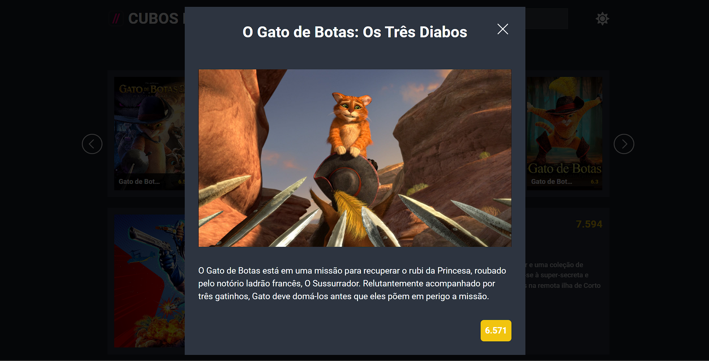

# Desafio do Módulo 3 - API de Filmes

## Essse desafio consiste em implementar uma API com HTML atravéz da DOM com JavaScript, simulando um serviço de streaming que tenha:
- Barra de Busca 
- Carrossel
- um Filme em destaque no dia (segundo a API)
- Modo Escuro
- Modal que mostre as informações do filme selecionado

## Essa API tem dados variados sobres diversos filmes, como: 
- Titulo
- Cartazes
- Posters
- Sinopses
- Datas de Lançamentos
- links dos trailers
- Notas
- etc

#### A página que será mostrada ao abrir é esta:
> 

#### Página no modo escuro:
> 

#### Ao clicar em um filme um modal ira se abrir, com os dados do filme clicado:
> 

#### Modal no modo escuro:
> 

#### Na Barra de busca ao digitar uma palavra e pressionar "Enter", os filmes relacionados a essa palavra serão mostrados.
> #### Exemplo: buscando a palavra "Gato":
> 

#### Busca no modo escuro:

#### Modal de um filme após a busca:

#### Modal de um filme após a busca no modo escuro:

